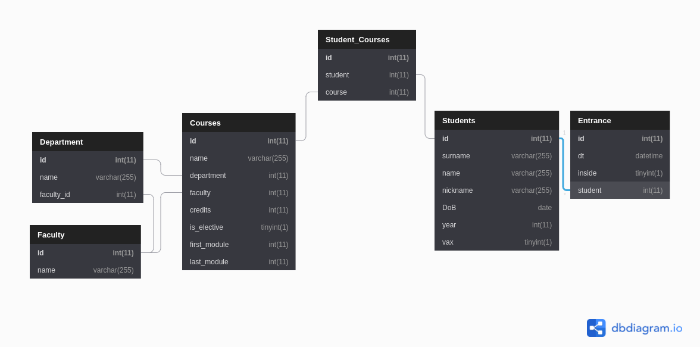

# задание 4.1. отчёт

## описание
### основные сущности:
- Students  
Описание: студенты университета
Поля:  

| поле | тип | описание | primary key |
| ------ | ------ | ------ | ------ |
| `id` | `int` | ключ | `PRIMARY KEY AUTO_INCREMENT` |
| `surname` | `varchar(255)` | фамилия |  |
| `name` | `varchar(255)` | имя |  |
| `nickname` | `varchar(255)` | username (первая часть почты) |  |
| `DoB` | `date` | дата рождения |  |
| `year` | `int` | год обучения (курс) |  |
| `vax` | `boolean` | статус вакцинации |  |

- Courses  
Описание: курсы университета  
Поля:  

| поле | тип | описание | primary key |
| ------ | ------ | ------ | ------ |
| `id` | `int` | ключ | `PRIMARY KEY AUTO_INCREMENT` |
| `name` | `varchar(255)` | название курса |  |
| `department` | `int` | id департамента | `FOREIGN KEY department => Department.id` |
| `faculty` | `int` | id факультета | `FOREIGN KEY faculty => Faculty.id` |
| `credits` | `int` | количество кредитов за данный курс |  |
| `is_elective` | `boolean` | является ли этот курс элективом |  |
| `first_module` | `int` | номер модуля, в котором начинается курс |  |
| `last_module` | `int` | номер модуля, в котором завершается курс |  |

- Entrance  
Описание: журнал прохода через турникет  
Поля:  

| поле | тип | описание | primary key |
| ------ | ------ | ------ | ------ |
| `id` | `int` | ключ | `PRIMARY KEY AUTO_INCREMENT` |
| `dt` | `datetime` | отметка времени |  |
| `inside` | `boolean` | вошёл ли человек (`true` если запись описывает вход в здание) |  |
| `student` | `int` | id студента | `FOREIGN KEY student => Students.id` |

### справочники:
- Faculty  
Описание: факультеты университета
Поля:  

| поле | тип | описание | primary key |
| ------ | ------ | ------ | ------ |
| `id` | `int` | ключ | `PRIMARY KEY AUTO_INCREMENT` |
| `name` | `varchar(255)` | название факультета |  |

- Department  
Описание: департаменты факультетов университета
Поля:  

| поле | тип | описание | primary key |
| ------ | ------ | ------ | ------ |
| `id` | `int` | ключ | `PRIMARY KEY AUTO_INCREMENT` |
| `name` | `varchar(255)` | название департамента |  |
| `faculty` | `int` | id факультета, к которому относится департамент | `FOREIGN KEY faculty => Faculty.id` |

### связь Many-to-Many
- Student_Courses
Описание: хранит отношения между студентами и курсами (какие курсы изучает студент)
Поля:  

| поле | тип | описание | primary key |
| ------ | ------ | ------ | ------ |
| `id` | `int` | ключ | `PRIMARY KEY AUTO_INCREMENT` |
| `student` | `int` | id студента | `FOREIGN KEY student => Students.id` |
| `course` | `int` | id курса | `FOREIGN KEY course => Courses.id` |


## схема



---  
## DDL для генерации таких таблиц:
```sql
use lms;

create table Faculty
(
    id   int primary key auto_increment,
    name varchar(255)
);

create table Department
(
    id      int primary key auto_increment,
    name    varchar(255),
    faculty int,
    foreign key (faculty)
        references Faculty (id)
);

CREATE TABLE Students
(
    id       int PRIMARY KEY AUTO_INCREMENT,
    surname  varchar(255),
    name     varchar(255),
    nickname varchar(255),
    DoB      date,
    year     int,
    vax      boolean
);

create table Courses
(
    id           int PRIMARY KEY AUTO_INCREMENT,
    name         varchar(255),
    department   int,
    faculty      int,
    credits      int,
    is_elective  boolean,
    first_module int,
    last_module  int,
    FOREIGN KEY (department)
        REFERENCES Department (id),
    foreign key (faculty)
        references Faculty (id)
);

create table Entrance
(
    id      int PRIMARY KEY AUTO_INCREMENT,
    dt      datetime,
    inside  boolean,
    student int,
    foreign key (student)
        references Students (id)
);

create table Student_Courses
(
    id      int PRIMARY KEY AUTO_INCREMENT,
    student int,
    course  int,
    foreign key (student)
        references Students (id),
    foreign key (course)
        references Courses (id)
);
```